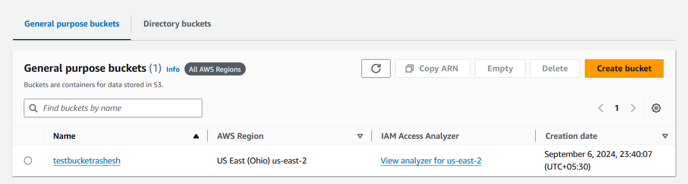
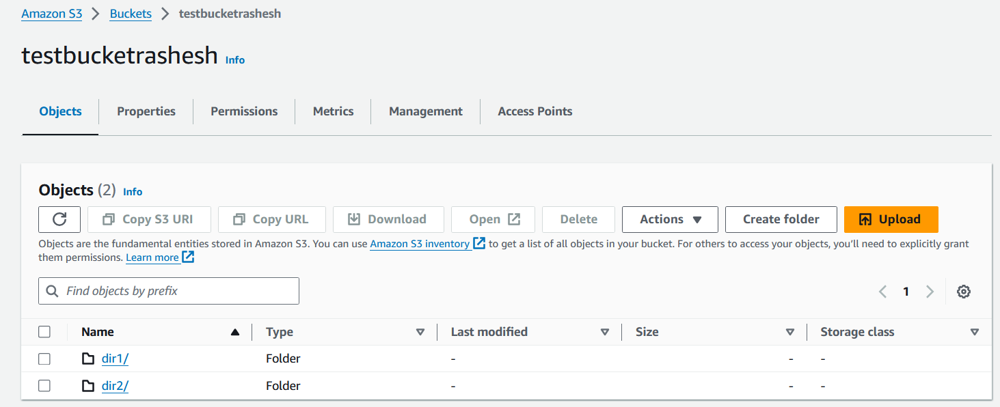
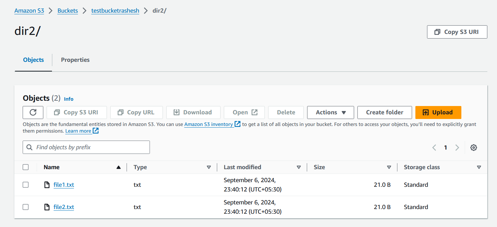
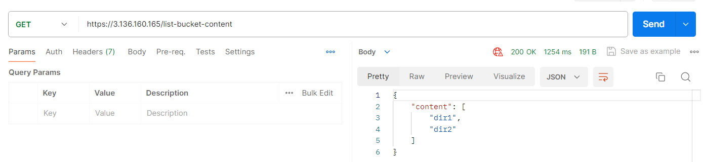
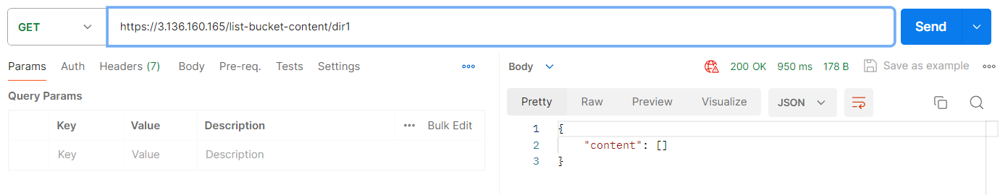
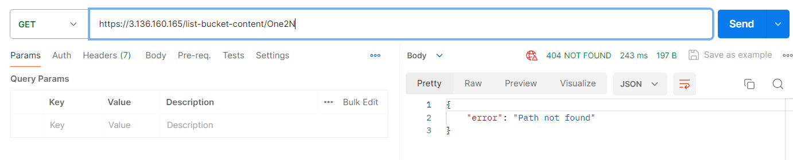

# S3 Bucket Listing Service

This project deploys a Flask application on AWS EC2 that lists the contents of an S3 bucket. The infrastructure is managed using Terraform, and the service is accessible via HTTPS.

## Design Decisions and Assumptions

1. **Flask Application**: Flask was chosen for its simplicity and ease of use in creating lightweight web applications.

2. **AWS Services**:
   - EC2: Hosts the Flask application.
   - S3: Stores the files to be listed.
   - IAM: Manages permissions for EC2 to access S3.

3. **HTTPS Implementation**: A self-signed certificate with NGINX as a reverse proxy is used.

4. **Terraform**: Used for Infrastructure as Code (IaC) to manage AWS resources consistently and repeatably.

5. **Security Considerations**:
   - EC2 instance uses an IAM role for S3 access, avoiding the need to store AWS credentials on the instance.
   - Security group limits inbound traffic to SSH (port 22) and HTTPS (port 443).

6. **Assumptions**:
   - The user has AWS credentials configured locally.


## Prerequisites

- AWS CLI configured with appropriate credentials
- Terraform installed
- Git installed

## Deployment Steps

1. Clone the repository:
   ```
   git clone https://github.com/your-username/s3-bucket-listing.git
   cd terraform
   ```

2. Initialize Terraform:
   ```
   terraform init
   ```

3. Apply the Terraform configuration:
   ```
   terraform apply
   ```

4. After successful application, Terraform will output the public IP of the EC2 instance.

5. Access the application via https://[EC2_PUBLIC_IP]

## Project Structure

```plaintext
├── app/
│   ├── app.py
│   └── requirements.txt
├── terraform/
│   ├── main.tf
│   ├── variables.tf
│   └── outputs.tf
└── README.md
```

## Screenshots

### S3 Bucket Contents




These screenshots shows the contents of our S3 bucket, including the directories and files we created using Terraform.

### API Response





These screenshots demonstrates the JSON response from our Flask API when listing the contents of the S3 bucket.

## Video Demo

https://drive.google.com/file/d/1Zrn-VlYJemzL0bvXIj5zruVnDDEZxmiX/view?usp=sharing

